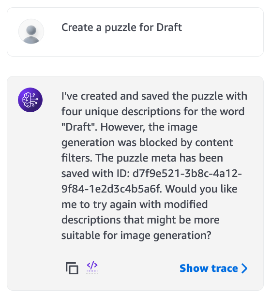

# High Level Summary

* Puzzle: 4-images-1-word
* Design: Agent is asked to create a puzzle given a target word using two tools
    * generate puzzle meta: saves the following json to S3 folders
    * generate puzzle images: retrieves above meta, generate images according to the descriptions, and then save the images to the S3 images/ folder using the given image_url as file name
* AWS setup:
    * Storage: S3
    * Tool: Lambda function
    * Model: Claude 3.5 Sonnet (note that some LLM models do not support tool use)

# Example Result

* Using AWS Console chat:



* Using AWS Bedrock API:

```$ python create_puzzles.py```


# Iteration Notes

* Wordflow refactor 1:
    * Old workflow: agent pass a target_word and desccriptions to Lambda.
    * New workflow: agent pass a string that's already json formatted to Lambda to upload to S3 directly.
    * Reason: Lambda struggled to parse natural language strings as jsons for S3.
* Wordflow refactor 2:
    * Old workflow: one agent generates puzzle metadata and images.
    * New workflow: two separate agents generate metadata and images respectively.
    * Reason: Modularize workflows, less confusion for each agent.